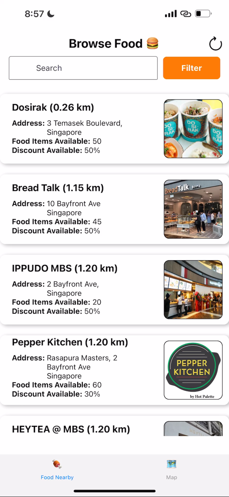
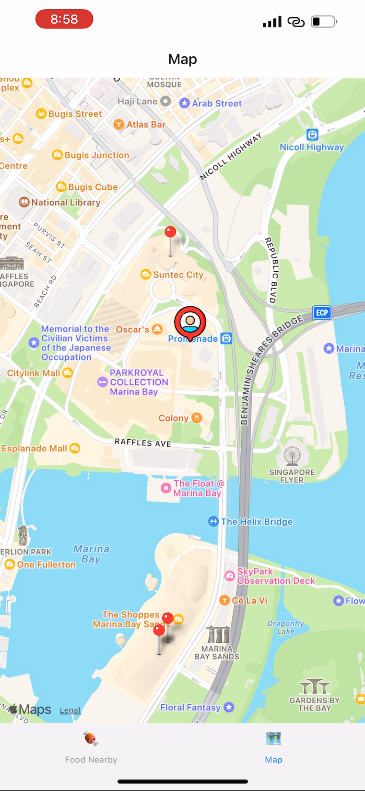
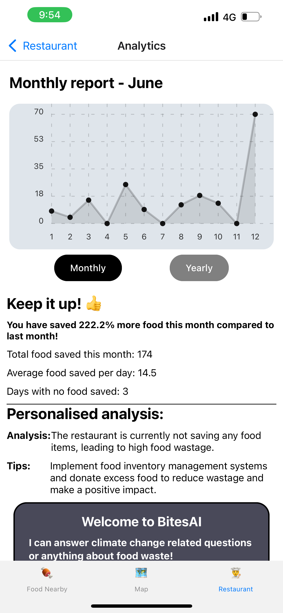
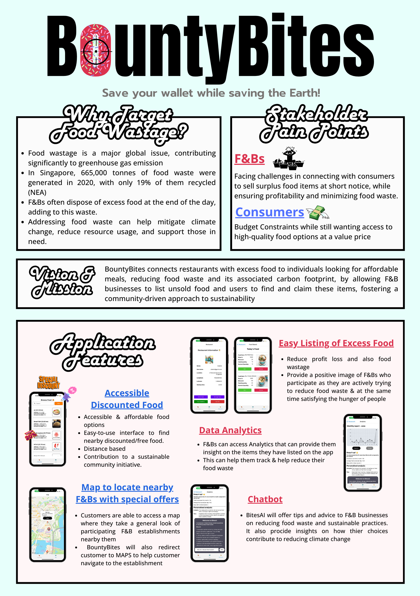

# BountyBites
BountyBites is an innovative mobile application designed to tackle food wastage in Singapore. This platform allows F&B establishments to list their surplus food at discounted prices or for free, making it accessible to people in need.

Built within 4 days for **DSTA BrainHack 2024 CODE_EXP**. Finalist team for uni category.

View our demo video here: [BountyBites Demo](https://www.youtube.com/watch?v=IIygiI8FV4w)

## Tech Stack
- React Native, NodeJS
- Firebase (Firestore, Authentication, Storage)
- OpenAI API
- Expo

## Collaborators
- Nicholas: [Github](https://github.com/nicleongyj)
- Ying Hao : [Github](https://github.com/calamityfalls)
- Royce: [Github](https://github.com/spyabi) 

## Features
- Easy listing of surplus food items for restaurants
- Accessible & affordable real-time food browsing for consumers
- Data Collection and Analytics to help restaurants understand and track their food wastage patterns
- In-built GPT-3.5-Turbo language model programmed to answer and queries about climate change and food wastage, or provide indepth analyis of the restaurant's food wastage patterns
- Map view and navigation to find nearby discounted/free food
- Easy-to-use interface to find nearby discounted/free food

  
  
  

  

    
  

## Future Works
- Utilises AI to analyse restaurants food wastage patterns and provide personalised insights on how to reduce food wastage
- User feedback system to improve service and user experience
- Collaborate with delivery services for last-mile food distribution
- Partner with local charities and food banks for greater outreach
